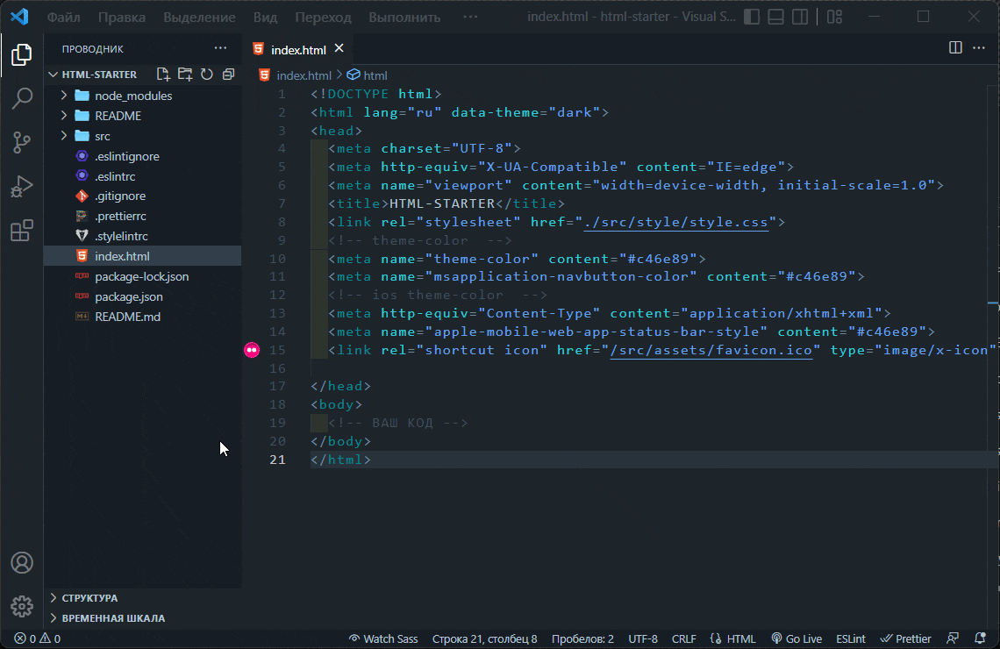

## HTML STARTER 

Используя html-starter, мы создаём из лучших практик построения css основу   для нового проекта.
( по умолчанию темная цветовая тема)

В котором настроенны:
  <details >
  <summary >✅ HTML</summary>

  [Что это?](https://developer.mozilla.org/ru/docs/Learn/Getting_started_with_the_web/HTML_basics)

    Это код, который используется для структурирования и отображения веб-страницы и её контента.

</details>

<details >
  <summary> ✅SCSS</summary>

  [Что это?](https://sass-scss.ru/)  

    Вы можете изменять  настройки в вашем проекте. 
    Для  автоматического комполирования файлов css необходимо запустить 

  Live Sass Compiler 

  [Что это?](https://marketplace.visualstudio.com/items?itemName=ritwickdey.live-sass)  

    В проекте scss создает 2 css файла style-light style-dark 
    для разных цветовых тем.

    Конфигурации нужно изменять в файлах variables_light.scss variables_dark.scss 
</details>

  - ✅@import

<details>
  <summary>✅ ESLintint</summary>

  [Что это?](https://eslint.org/) 

    ESLint статически анализирует ваш код, чтобы быстро найти проблемы. Он встроен в большинство текстовых редакторов.
</details>

<details>
  <summary>✅ Stylelint</summary>

  [Что это?](https://stylelint.io/) 

    Мощный современный линтер, который поможет вам избежать ошибок и обеспечить соблюдение соглашений в ваших стилях.
</details>

<details>
  <summary>✅ Prettier</summary>

  [Что это?](https://prettier.io/) 

    Форматировщик кода Поддерживает множество языков интегрируется с большинством редакторов.
</details>


  - ✅ Readme
  - ☑️ Gitignore

<!-- Изображение -->


#
## Команды


|                        |                           |
|------------------------|:--------------------------|
| Установить зависимости | `npm i`                   |
| Запустить ESLint       | `npm run lint --fix`      |
| Запустить StyLelint    | `npm run stylelint --fix` |

<!-- | Запустить локально     | `npm run serve --open`|
| Собрать                | `npm run build`       | -->


# 
## Для запуска потребуется
- Этот репозиторий 
 ```
git clone https://github.com/VladislavBobyrev/bbrf-html-starter .
```

- NPM
```
npm i -D eslint-config-airbnb-base stylelint stylelint-order stylelint-scss stylelint-color-format prettier
```

- Live Sass Compiler

```
https://marketplace.visualstudio.com/items?itemName=ritwickdey.live-sass
```

- Live Server

```
https://marketplace.visualstudio.com/items?itemName=ritwickdey.LiveServer
```

- браузер


#
## Связвться со мной

<div align='center'> 

  ```
  vladislavbobyrev@yandex.ru
  ```

 [](https://t.me/VladislavBobyrev)
</div>
 
<div align="center">
  <h2>**ВНИМАНИЕ!**  Вся конфигурация является открытой. </h2>
  **ВНИМАНИЕ!** На компьютере должны быть установлены программы `node` и `npm`.
  Генерация  занимает много времени за счёт
  установки `node_modules`. Необходимо дождаться окончания этого процесса.
</div>
